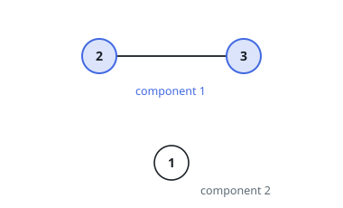

# Count Matrix Components

## Description

You are given an `n x n` matrix `adjacency` describing an undirected graph
with `n` nodes: `adjacency[i][j]` is `1` when node `i` and node `j` are
joined directly by an edge, and `0` when they are not.

Two nodes sit in the same **component** when a chain of edges links them —
directly, or by passing through other nodes.

Return the number of components in the graph.

### Example 1

```text
Input: adjacency = [[1,0,0],[0,1,1],[0,1,1]]
Output: 2
Explanation: Nodes 2 and 3 share an edge. Node 1 is joined to neither, so
it makes up a component on its own.
```



### Example 2

```text
Input: adjacency = [[1,0,0,0],[0,1,0,0],[0,0,1,0],[0,0,0,1]]
Output: 4
Explanation: Not a single edge exists, so each of the four nodes is its
own component.
```

### Example 3

```text
Input: adjacency = [[1,0,0,1],[0,1,0,1],[0,0,1,1],[1,1,1,1]]
Output: 1
Explanation: Node 4 is joined to each of nodes 1, 2, and 3, so every node
chains to every other through it.
```

### Constraints

- `1 <= n <= 200`
- `n == adjacency.length`
- `n == adjacency[i].length`
- `adjacency[i][j]` is `1` or `0`.
- `adjacency[i][i] == 1`
- `adjacency[i][j] == adjacency[j][i]`

## Hints

### Hint 1

Components are exactly the connected components of the graph — each node
belongs to precisely one, so the components split the nodes into disjoint
groups.

### Hint 2

Sweep the nodes in order. Each node that no earlier sweep has reached is
the first member of a fresh component: count it, then flood through
everything reachable from it, by depth or by breadth — either marks the
whole component.

### Hint 3

Merging works too: start every node as its own set, join the sets behind
every `adjacency[i][j] == 1` pair, and count the sets that survive.
