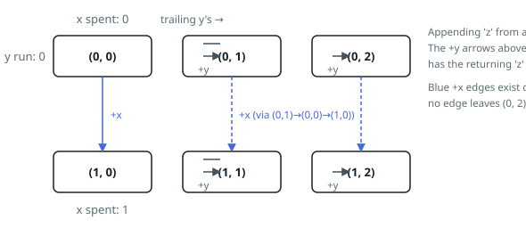

# Solutions — Count Constrained Strings

## Dynamic Programming Over (Spent x, Trailing y Run)

Nothing about a partially built string matters to its future except two
numbers: how many `x`s it has already used, and how long its current tail of
`y`s is. The first is 0 or 1 — a string with two `x`s is already dead — and the
second is 0, 1 or 2 for the same reason. Six situations, and every constrained
string of a given length falls into exactly one of them.

So instead of strings, count populations. Let `dp[a][l]` hold the number of
constrained strings of the current length that have spent `a` copies of `x` and
end in `l` consecutive `y`s. The empty string starts the table at
`dp[0][0] = 1`, and one pass rebuilds the whole table for the next length:

- appending `z` is always legal and lands in `dp[a][0]`;
- appending `x` is legal only from `a = 0` and lands in `dp[1][0]`;
- appending `y` is legal only from `l < 2` and lands in `dp[a][l + 1]`.

Each destination collects sums from its sources modulo `10⁹ + 7`. Notice that
the two blocked moves are exactly the two rules: a string that has spent its
`x` is offered no `x`, and one already ending in `yy` is offered no `y`. Illegal
strings are never built, so nothing has to be filtered out afterwards, and the
recurrence never double-counts — each string of length `k + 1` names its own
last letter, hence exactly one predecessor.

Walking the first steps of Example 1 shows the shape. Writing each table as
`[[a=0 row], [a=1 row]]` indexed by the trailing run:

1. length 0 — `[[1, 0, 0], [0, 0, 0]]`, the empty string;
2. length 1 — `[[1, 1, 0], [1, 0, 0]]`, that is `z`, `y`, and `x`, total 3;
3. length 2 — `[[2, 1, 1], [3, 1, 0]]`, total 8, the one casualty among the nine
   pairs being `xx`;
4. and onward, the totals reading 19, 43, 94, 200, 418, and at length 8 the
   answer 861.

The table has a fixed six entries, so a step costs a constant amount of work
regardless of how far along it is, and the previous table can be discarded as
soon as the next is built. The `n = 1` case needs no special handling: one step
from the seed leaves three populated states.

**Complexity:** `O(n)` time, `O(1)` space.
