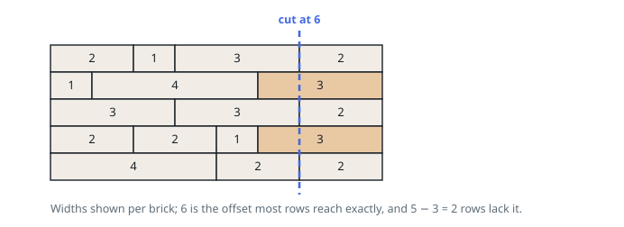

# Solutions — Fewest Bricks Split

## Prefix-Sum Edge Counting

The quantity the problem asks for is hard to attack head-on, but its complement
is easy. A vertical cut at offset `p` leaves row `i` intact precisely when `p`
is one of the offsets where two of that row's bricks meet; otherwise it lands in
the middle of a brick and breaks it. So the number of bricks split equals `n`
minus the number of rows that have a joint at `p`, and the best cut is the
offset that the most rows agree on.

Finding that offset takes one sweep. Walk each row keeping a running total of
the widths seen so far, and record every total in a hash map keyed by offset.
The final total — the wall's full width — is deliberately skipped, because that
offset is the outer face the cut may not use; in code this is the `row[:-1]`
that stops one brick early.

With the map built, the answer is `len(wall)` minus the largest tally in it.
The `default=0` on the `max` handles the wall whose rows are each a single
brick: no interior joints were ever recorded, the map is empty, and the formula
correctly reports that every row loses a brick.

Every brick is touched once and contributes at most one map entry, so both time
and space scale with the brick count rather than with the wall's width — which
matters, since the width can be astronomically larger than the number of
bricks. Those running totals are sums of values as large as `2^31 - 1`, so ports
to fixed-width languages must accumulate them in 64 bits even though the answer
itself is a small count.

**Complexity:** `O(S)` time, `O(S)` space, where `S` is the total number of bricks across all rows.
