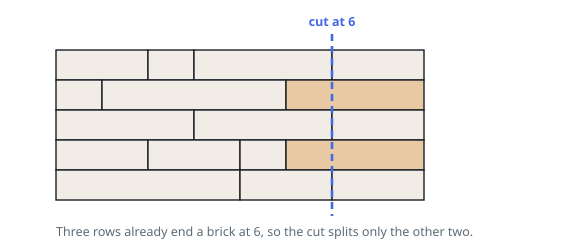

# Fewest Bricks Split

## Description

A wall is stacked from `n` rows of bricks. Every brick is one unit tall, and
`wall[i]` lists the widths of the bricks in row `i`, left to right. The rows all
span the same total width, though they break it up differently.

Slice the wall with a single vertical cut running its whole height. The cut has
to land strictly inside the wall — the two outer faces are not allowed — and a
brick escapes unharmed when the cut coincides with one of its ends. Return the
smallest number of bricks such a cut can split.

### Example 1

```text
Input: wall = [[2,1,3,2],[1,4,3],[3,3,2],[2,2,1,3],[4,2,2]]
Output: 2
Explanation: Cutting at offset 6 passes along a joint in rows 1, 3 and 5, so
only the remaining two rows lose a brick.
```



### Example 2

```text
Input: wall = [[3,2],[3,2],[3,1,1]]
Output: 0
Explanation: Offset 3 is a joint in all three rows, so nothing is split.
```

### Example 3

```text
Input: wall = [[6],[6],[6],[6]]
Output: 4
Explanation: No row has an interior joint, so wherever the cut goes it splits
all four bricks.
```

### Constraints

- `n == wall.length`, with `1 <= n <= 10^4`
- each row holds between `1` and `10^4` bricks
- the whole wall holds at most `2 * 10^4` bricks: `1 <= sum(wall[i].length) <= 2 * 10^4`
- `1 <= wall[i][j] <= 2^31 - 1`
- every row adds up to the same width

## Hints

### Hint 1

Counting the bricks a cut breaks is awkward. Count instead the rows it slips
through cleanly, and subtract from `n`.

### Hint 2

A cut slips through row `i` cleanly exactly when its offset is one of that row's
running totals. The full width is a running total too, but it is the outer face
and therefore off limits.

### Hint 3

Tally those offsets across all rows in a map, keyed by offset. The offset with
the biggest tally is where to cut, and the answer is `n` minus that tally. When
the map is empty, every row is one solid brick and the answer is `n`.

### Hint 4

Widths reach `2^31 - 1` and a running total sums many of them, so a fixed-width
language needs a 64-bit accumulator for the offsets.
