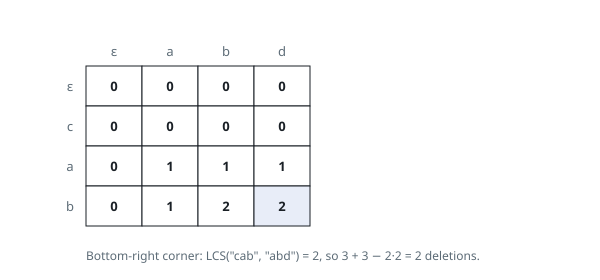

# Solutions — Equalize Strings by Deletion

## Longest Common Subsequence

Deletion can leave only a subsequence of each word. Any text made equal is
therefore a common subsequence, and keeping the longest such text minimizes
the deleted characters. If the longest common subsequence has length `L`, the
number removed is `len(word1) + len(word2) - 2L`.

Build the standard prefix table. `dp[i][j]` stores the LCS length for the first
`i` characters of `word1` and first `j` characters of `word2`. Equal trailing
characters extend the diagonal entry; unequal ones take the larger value from
the prefix that omits one trailing character.

For `"cab"` and `"abd"`, the retained subsequence is `"ab"`, so six total
characters minus four retained copies gives two deletions.

**Complexity:** `O(L1 * L2)` time and `O(L1 * L2)` space.
