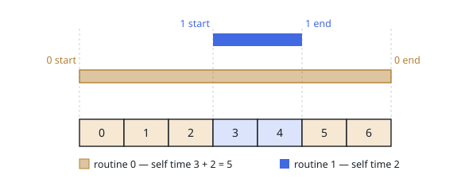

# Routine Self Times

## Description

A single-threaded machine runs `n` routines, numbered `0` through `n - 1`. One
routine holds the processor at a time: entering a routine pushes its number onto
a stack, leaving it pops the number off, and the number on top is whoever is
running. A routine may be entered again while an earlier entry of it is still
open, so the same number can sit at several depths at once.

Time is counted in whole units. You are given `events`, the trace of one run in
chronological order. Each entry is a string of three colon-separated fields:

```text
<number>:start:<unit>   that routine takes the processor at the start of that unit
<number>:end:<unit>     that routine gives it back at the end of that unit
```

The **self time** of a routine is the number of units during which one of its
entries was on top of the stack. Units burned inside something it entered belong
to that entry instead, even when the entry carries the same number.

Return an array whose `i`-th value is the self time of routine `i`.

### Example 1

```text
Input: n = 2, events = ["0:start:0","1:start:3","1:end:4","0:end:6"]
Output: [5,2]
Explanation: Routine 0 holds units 0, 1 and 2, hands the processor over for
units 3 and 4, and takes it back for units 5 and 6 — so 3 + 2 = 5 against 2.
```



### Example 2

```text
Input: n = 1, events = ["0:start:0","0:start:1","0:end:3","0:end:4"]
Output: [5]
Explanation: The outer entry holds unit 0, the inner entry holds units 1 to 3,
and the outer entry finishes with unit 4. Both entries are routine 0, so its
self time is 1 + 3 + 1 = 5.
```

### Example 3

```text
Input: n = 3, events = ["1:start:2","1:end:4","0:start:5","2:start:6","2:end:6","0:end:8"]
Output: [3,3,1]
Explanation: Routine 1 runs alone across units 2 to 4. Routine 0 then takes
unit 5, lends the processor to routine 2 for unit 6 alone, and closes with
units 7 and 8. The machine is idle before unit 2 — idle time belongs to nobody.
```

### Constraints

- `1 <= n <= 100`
- `2 <= events.length <= 500`
- Every number appearing in the trace is at least `0` and less than `n`
- Every unit appearing in the trace is between `0` and `10⁹`
- No two entries start on the same unit, and no two finish on the same unit
- Every start is matched by a later end, so the trace is a well-formed run

## Hints

### Hint 1

Replay the trace in order, holding the open entries on a stack. At any instant
the top of that stack names the routine being charged.

### Hint 2

Store with each stacked entry the unit at which it took, or retook, the
processor. A new entry starting at unit `t` means the entry it interrupts has
just earned everything from its resume point up to — but not including — `t`.

### Hint 3

An end at unit `t` runs through the finish of `t`, so the closing entry earns
`t - resume + 1`, and whatever lies beneath it resumes at `t + 1`.

### Hint 4

Every unit is then charged exactly once, to whoever was on top when it elapsed.
Recursion needs no special handling: two entries with the same number simply add
into the same slot of the answer.
