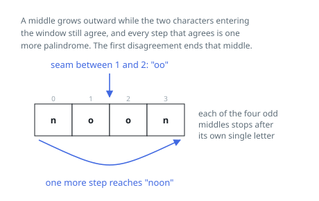

# Solutions — Count Palindrome Slices

## Grow Each Middle Outward

Symmetry gives every palindrome a middle, and in a string of length `n` there
are only `2n - 1` places a middle can sit: on any of the `n` characters, or in
any of the `n - 1` seams between neighbours. Walking outward from each of those
places and stopping at the first mismatch enumerates every palindromic slice
once and only once — once, because a slice is discovered from its own middle
and no other; every one, because a slice's middle is always among the `2n - 1`.
That is also what makes repeated spellings count separately: the two `"o"`
slices of `"noon"` sit on different middles.

The loop visits each index and tries both middle shapes, `(i, i)` for odd
lengths and `(i, i + 1)` for even. Two cursors then step apart while they stay
inside the string and the characters they land on agree. Each successful step
adds one to the total, and the total is correct because the wider slice is a
palindrome exactly when the inner one already was and the two new outer
characters match. A mismatch ends the walk: nothing wrapped around a failing
pair can bring the symmetry back.

The saving over brute force is in the sharing. One walk of length `L` certifies
`L` palindromic slices using `L` character comparisons, where testing each of
those slices independently would re-read every character it contains. The
expensive input is a long run of one repeated letter, where every walk reaches
an end of the string.

Nothing is stored except the cursors and the running count — no table of
already-verified ranges is needed.

**Complexity:** `O(n^2)` time, `O(1)` space.
