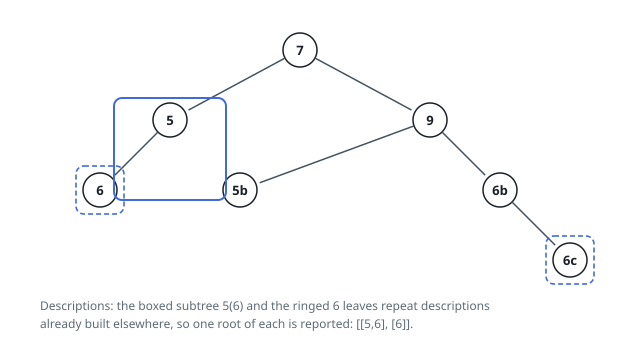

# Solutions — Repeated Subtrees

## Post-Order Serialization

Testing subtrees against each other directly would mean comparing every pair,
and there are up to 5000 of them. The way out is to describe each subtree by a
string so faithful that string equality *is* subtree equality, then let a hash
map do the matching.

A node's description is its value followed by the descriptions of its left and
right children, with a placeholder — say `#` — standing in for a child that is
not there. Those placeholders are what make the description faithful. Drop them
and a node with only a left child becomes indistinguishable from the same node
with only a right child, which would report mirror images as repeats. Keeping
them, a description determines the subtree exactly.

Since a node's description is assembled from its children's, one post-order walk
labels the entire tree. The walk keeps a map from description to a small record:
the first node that carried it, how many nodes have carried it, and the walk
position of the most recent one. Nodes past the first only update the count and
the position; the stored node is the one that will be reported, which is legal
because any occurrence may be handed back.

Take Example 1. The leaf `6` under the root's left child is described `6,#,#`,
and both later `6` leaves produce that same string, so its tally reaches three.
The node `5` above the first of them is described `5,6,#,#,#`, and the `5`
hanging under the `9` builds the identical string, so that tally reaches two.
Every other description is unique. Filtering the map to records with a count of
at least two, ordered by the recorded position, leaves the two reported roots.

The work per node is one string assembly and one map operation. Assembly is the
expensive part: a description contains its children's descriptions, so along a
long path the strings grow with depth and the total character count can reach
quadratic size on a degenerate chain. A bushy tree behaves far better, but the
worst case is real, and the map holds every distinct description, giving the
same bound in space.

**Complexity:** `O(n²)` time and `O(n²)` space in the worst case.
