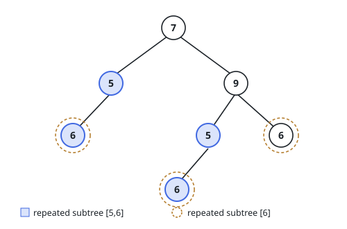
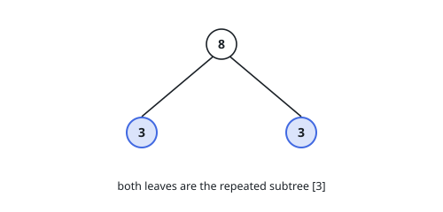
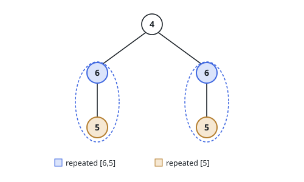

# Repeated Subtrees

## Description

Given the `root` of a binary tree, find the subtrees that occur in it more than
once, and hand back one occurrence of each.

A subtree means a node together with everything hanging below it. Two of them
count as the same subtree when their shapes agree and the values at matching
positions agree — a mirror image is a different subtree, not the same one. For
each subtree that shows up at least twice, return the root node of any single
occurrence.

### Example 1

```text
Input: root = [7,5,9,6,null,5,6,null,null,6]
Output: [[5,6],[6]]
Explanation: A 5 carrying a lone left child 6 appears under the root and again
under the 9, and the bare leaf 6 appears three times.
```



### Example 2

```text
Input: root = [8,3,3]
Output: [[3]]
Explanation: The two leaves are the same one-node subtree; the root itself
occurs only once.
```



### Example 3

```text
Input: root = [4,6,6,5,null,5,null]
Output: [[6,5],[5]]
Explanation: The root's two halves are identical, so both the two-node subtree
and the leaf inside it are repeats.
```



### Constraints

- The tree holds between `1` and `5000` nodes.
- `-200 <= Node.val <= 200`

## Hints

### Hint 1

Comparing subtrees against each other pairwise is far too slow. Give each
subtree a written form instead, chosen so that two subtrees are the same
precisely when their written forms match, and the comparison becomes a lookup.

### Hint 2

The form has to record the missing children as well as the present ones. Write
nothing for an absent child and two differently shaped subtrees — a value with a
left child, and the same value with a right child — end up indistinguishable.

### Hint 3

Build the forms from the bottom up: a node's form is its own value together with
the forms already built for its two children. One post-order walk produces every
form in the tree.

### Hint 4

Tally the forms as they are built, remembering alongside each tally the first
node that produced it. Any form whose tally reaches two contributes its
remembered node to the answer.
