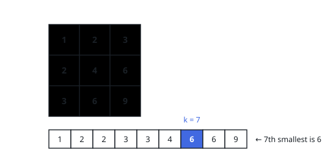
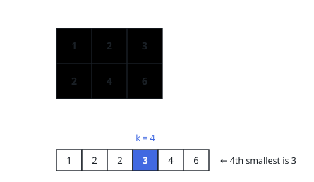

# Product Grid Order Statistic

## Description

Define an `m` by `n` grid whose one-indexed cell `(i, j)` contains `i * j`.
When all `m * n` cell values are sorted with duplicates retained, return the
value at position `k` using one-based indexing.

### Example 1

```text
Input: m = 3, n = 3, k = 7
Output: 6
```



### Example 2

```text
Input: m = 2, n = 3, k = 4
Output: 3
```



### Constraints

- `1 <= m, n <= 3 * 10^4`
- `1 <= k <= m * n`

## Hints

### Hint 1

Binary-search the returned value between `1` and `m * n`.

### Hint 2

Row `i` contains `min(value // i, n)` entries no greater than a proposed
value.

### Hint 3

Find the first value whose accumulated row count reaches `k`.
