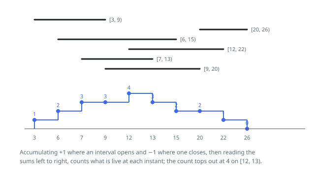

# Solutions — Peak Booking Depth

## Boundary Delta Sweep

Depth is a property of instants, but it only ever moves at an endpoint. Turn
each recorded span `[start, end)` into two attachments — `+1` filed under
`start`, `-1` filed under `end` — and keep them in a map keyed by position,
summing whenever two spans share an endpoint. Reading that map in increasing
order of position and carrying a running total gives, after each position, the
number of spans covering the stretch that begins there. The largest total the
walk reaches is the depth, which is what every `add` has to hand back.

Each call files its own two attachments and then re-walks everything stored so
far. The half-open convention needs no tie-breaking rule: because attachments
at one position are summed before the running total is read, a `-1` from a span
letting go and a `+1` from a span taking hold cancel exactly, and the total that
comes out counts only spans that really do cover the stretch ahead. Spans laid
end to end therefore report depth `1`, however many of them there are.

Re-walking from scratch on every call is deliberate. After `n` calls the map
holds at most `2n` positions, so one call sorts and scans at most that many
entries; capped at 400 calls the whole run stays in the low hundreds of
thousands of steps, and the code stays short enough to be obviously right.

**Complexity:** `O(n^2 log n)` time over `n` calls, `O(n)` space.
