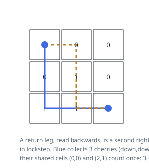

# Solutions — Round-Trip Cherry Harvest

## Two-Walker Lockstep Dynamic Programming

Walk the return leg in reverse and it turns into a second right-and-down walk:
corner to corner, monotonically, exactly like the first. So the round trip is
equivalent to two pickers leaving `(0, 0)` together, both heading to
`(n-1, n-1)` with right and down steps only, where a cherry on a cell touched
by both pays out once. The complication is that a greedy pair of best-outbound
walks can double-use the middle of the grid; the fix is to move the pickers
together, one grid step at a time. After `t` steps picker one stands at
`(r1, t - r1)` and picker two at `(r2, t - r2)`, so a single layer index `t`
describes both, and sharing becomes observable rather than assumed away: the
two can only split a cherry when `r1 == r2`, the same cell at the same step.

On the worked grid `[[1,0,0],[0,1,0],[1,1,0]]`, the blue picker takes down,
down, right, right for the cherries at `(0,0)`, `(2,0)` and `(2,1)`; the amber
picker takes right, down, down, right and reaches `(0,1)`'s diagonal partner
`(1,1)`. Jointly they sweep every cherry in the grid — four — with the two
overlapping cells contributing once each, and no pairing of walks beats that.

The code keeps `dp[r1][r2]` as the best joint total for the layer in progress
and rebuilds it from the previous layer each step, each picker having arrived
from above or from the left — four predecessor states, of which the best
reachable one is kept. Thorn cells and out-of-range rows are skipped outright;
a state all of whose predecessors died stays dead, so unreachability spreads
through the layers by itself. The step gain is `grid[r1][c1]` plus
`grid[r2][c2]` when the pickers sit apart, and a single `grid[r1][c1]` when
they coincide. Sweeping `r2` from `r1` exploits that the pair is
interchangeable and halves the state space.

The final corner state, clamped at `0`, is the answer: when every route is
walled off the sentinel survives to the end and the function reports an empty
harvest. Layers run `t` from `1` to `2n - 2`, each holding at most `n²/2`
live states with constant work per state, and only two layers are alive at
once.

**Complexity:** `O(n³)` time, `O(n²)` space.
