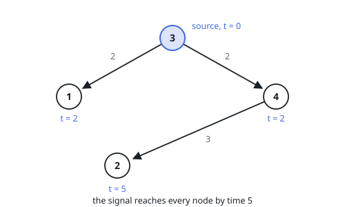

# Last To Hear The Signal

## Description

A directed network has `n` nodes, numbered `1` through `n`. The list `edges`
describes its links: `edges[i] = (ui, vi, wi)` means a message sent from `ui`
arrives at `vi` exactly `wi` time units later, and travels no other way.

At time `0` a signal is released from node `k` and floods forward through the
network. Return the first moment at which **every** node has received it, or
`-1` if at least one node can never be reached from `k`.

### Example 1

```text
Input: edges = [[3,1,2],[3,4,2],[4,2,3]], n = 4, k = 3
Output: 5
Explanation: Nodes 1 and 4 sit one hop from the source, so both are done at time 2. Node 2 must wait for the onward hop from node 4 and finishes at 2 + 3 = 5 — the last arrival, which is the answer.
```



### Example 2

```text
Input: edges = [[2,1,4]], n = 2, k = 2
Output: 4
```

### Example 3

```text
Input: edges = [[2,1,4]], n = 2, k = 1
Output: -1
Explanation: The only edge points away from node 1, so node 2 never receives the signal.
```

### Constraints

- `1 <= k <= n <= 100`
- `1 <= edges.length <= 6000`
- `edges[i].length == 3`
- `1 <= ui, vi <= n`
- `ui != vi`
- `0 <= wi <= 100`
- No pair `(ui, vi)` appears twice

## Hints

### Hint 1

When does a given node hear the signal? As early as its shortest route from
`k` allows. So which single number over the whole network answers the
question?

### Hint 2

All weights are non-negative, which is exactly the precondition for
Dijkstra's algorithm: a min-heap of candidates keeps the earliest-arriving
unsettled node on top.

### Hint 3

Count the nodes you settled. Fewer than `n` of them means the flood never
touched someone.
