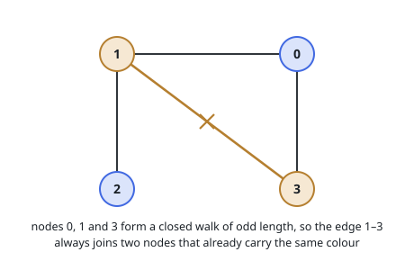
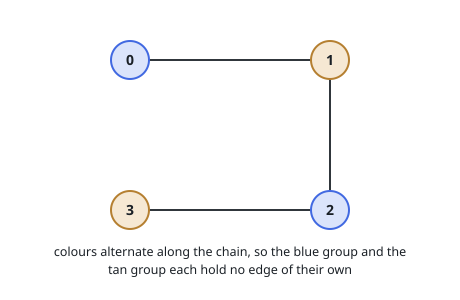

# Two-Colorable Graph

## Description

An undirected graph on `n` nodes, labelled `0` through `n - 1`, arrives as
adjacency lists: `graph[u]` names every node that shares an edge with `u`.
Decide whether the labels can be painted with two colours so that the two ends
of an edge never match, and return `true` exactly when such a painting exists.

Said the other way round, the nodes must fall into two groups, neither of which
holds an edge inside itself.

What you receive is a well-formed undirected graph: no list repeats a value or
mentions its own node, and `v` sits in `graph[u]` precisely when `u` sits in
`graph[v]`. Connectivity is not promised — some nodes may be unreachable from
others.

### Example 1

```text
Input: graph = [[1,3],[0,2,3],[1],[0,1]]
Output: false
Explanation: Nodes 0, 1 and 3 are pairwise adjacent. Two of the three would have
to share a colour whichever way they are painted, and those two are joined.
```



### Example 2

```text
Input: graph = [[1],[0,2],[1,3],[2]]
Output: true
Explanation: The four nodes form a chain 0-1-2-3. Painting alternately gives the
groups {0, 2} and {1, 3}, and every edge steps between them.
```



### Example 3

```text
Input: graph = [[2],[3],[0,4],[1],[2]]
Output: true
Explanation: The graph splits into a chain 0-2-4 and a separate edge 1-3. Each
piece is painted on its own; {0, 1, 4} and {2, 3} works.
```

### Constraints

- `graph.length == n`, with `1 <= n <= 100`
- `0 <= graph[u].length < n`
- Every entry of `graph[u]` lies between `0` and `n - 1`
- `u` never appears in `graph[u]`, and no value appears in it twice
- `u` belongs to `graph[v]` whenever `v` belongs to `graph[u]`

## Hints

### Hint 1

Painting is not a free choice after the first move. Once one node has a colour,
each of its neighbours is forced to the other colour, and their neighbours are
forced back again.

### Hint 2

Walk the graph and propagate that forced colour. The attempt only ever breaks
in one way: you arrive along an edge at a node already painted the colour you
were about to use.

### Hint 3

A single walk reaches one piece of the graph. Restart from every node that no
walk has painted yet, and answer `true` only if all of them finish without a
clash.
