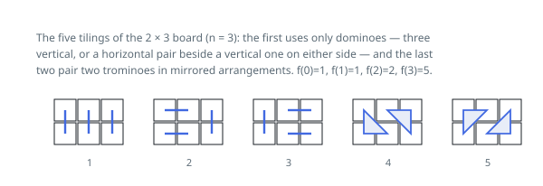

# Solutions — Two-Row Strip Tilings

## Linear DP with the f(n) = 2f(n-1) + f(n-3) recurrence

Lay the pieces down from the left and watch the right-hand frontier. Because
the strip is only two cells tall and the largest piece is three cells, the
frontier is never worse than ragged by a single cell: either the first `i`
columns are exactly full, or they are full plus one cell of column `i+1` that
an L-shaped piece already claimed. Write `f(i)` for the first count and `p(i)`
for the second, where `p(i)` folds the top-poking and bottom-poking shapes
together — they are mirror images and are counted identically.

Each transition is just a list of what can close the last column. A flush
frontier at `i` arises from a flush frontier at `i-1` capped by an upright
piece, from a flush frontier at `i-2` capped by two flat pieces, or from either
of the two ragged shapes at `i-1` completed by an L, which is where the factor
of two comes from. A ragged frontier at `i` arises from a ragged frontier at
`i-1` pushed along by one flat piece, or from a flush frontier at `i-2` with an
L placed on it.

Those two equations describe one sequence between them, and `p` can be removed.
What survives is a three-term relation on the flush counts alone:
`f(i) = 2·f(i-1) + f(i-3)`. It needs only `f(0) = 1`, `f(1) = 1` and
`f(2) = 2` to get going, and each step reduces modulo `10^9 + 7` so nothing
ever grows past a machine word. The first value the loop produces is
`f(3) = 2·2 + 1 = 5`, which is small enough to confirm by hand:

The code answers widths `1` and `2` from the seeds directly and enters the loop
only at width `3`, so the three rolling values are never read before they mean
what the recurrence says they mean. Nothing about the ragged counts has to be
stored: they were eliminated on paper, not at run time.

**Complexity:** `O(n)` time — a fixed amount of arithmetic per column — and
`O(1)` space for the three rolling values.
