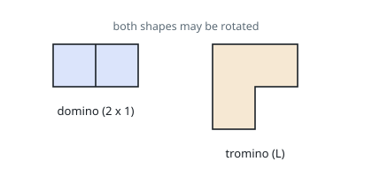

# Two-Row Strip Tilings

## Description

A grid strip is `2` rows tall and `n` columns wide, and has to be covered
completely with pieces of two kinds:

- a straight piece that occupies two neighbouring cells, and
- an L-shaped piece that occupies three cells.

Either kind may be turned to any of its rotations. No piece may overhang the
strip, and no cell may be covered twice. Count the coverings and, because the
count grows quickly, report it modulo `10^9 + 7`.



Two coverings are the same covering only when they group the cells into pieces
identically — what distinguishes them is where the seams between pieces fall,
not the order in which the pieces were laid down.

### Example 1

```text
Input: n = 2
Output: 2
Explanation: The square admits two upright pieces side by side, or two flat
pieces stacked. An L-shaped piece leaves one cell stranded, so it cannot start
a covering here.
```

### Example 2

```text
Input: n = 12
Output: 6105
Explanation: Far too many to list, which is why the count is worth computing
rather than enumerating. The modulus has not yet bitten at this width.
```

### Constraints

- `1 <= n <= 1000`

## Hints

### Hint 1

Build the strip column by column. After the first few columns are covered, the
frontier can be in only two conditions: cut off cleanly, or ragged, with one
cell of the next column already taken by an L-shaped piece.

### Hint 2

Count both conditions. A clean frontier at column `i` is reached by standing a
straight piece upright, by laying two flat ones across the previous two
columns, or by closing off either of the two ragged shapes with an L. A ragged
frontier is reached from a clean one with an L, or from a ragged one extended
by a flat piece.

### Hint 3

Substituting the ragged count away leaves one relation among clean counts
alone, of the form `f(i) = 2·f(i-1) + f(i-3)`. Three rolling values and a
modulo at every step are all the code needs.
