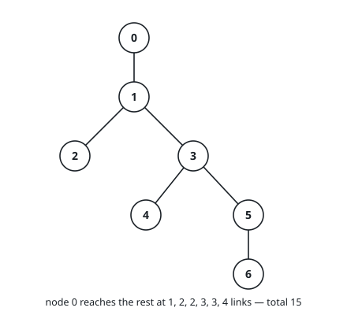
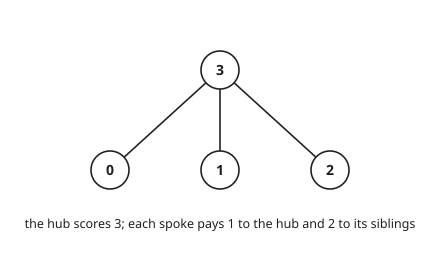
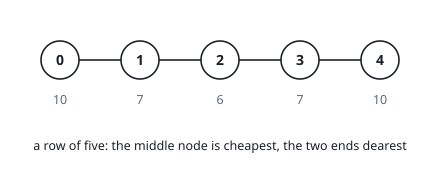

# Tree Distance Totals

## Description

A tree on `n` nodes, labelled `0` through `n - 1`, is described by `edges`: a
list of `n - 1` unordered pairs, where `edges[i] = [u, v]` puts an undirected
link between node `u` and node `v`. Exactly one path joins any two nodes, and
the distance between them is how many links that path uses.

Pick a node and add up its distance to every other node — that is the node's
*total*. Return all `n` totals, position `i` holding the total for node `i`.

### Example 1

```text
Input: n = 7, edges = [[0,1],[1,2],[1,3],[3,4],[3,5],[5,6]]
Output: [15,10,15,9,14,12,17]
Explanation: From node 0 the six distances are 1, 2, 2, 3, 3, 4, which add up
to 15. Node 3 sits deepest inside the tree and scores the smallest total, 9;
node 6 dangles at the far end and scores the largest, 17.
```



### Example 2

```text
Input: n = 4, edges = [[3,0],[3,1],[3,2]]
Output: [5,5,5,3]
```



### Example 3

```text
Input: n = 5, edges = [[0,1],[1,2],[2,3],[3,4]]
Output: [10,7,6,7,10]
```



### Constraints

- `1 <= n <= 3 * 10⁴`
- `edges` contains exactly `n - 1` pairs
- every `edges[i]` has two entries, `u` and `v`
- `0 <= u, v < n`, and `u != v`
- the pairs always describe a tree

## Hints

### Hint 1

Running a traversal out of every node costs `O(n^2)`, which `3 * 10^4` nodes
will not tolerate. Root the tree once, at node `0`, and see how much a single
sweep can record.

### Hint 2

Two numbers per node are enough to start: how many nodes lie in its subtree,
and the total distance from it down into that subtree. Both assemble from a
node's children — a child hands up its own downward total plus one extra step
for each node it carries.

### Hint 3

Now shift the root one link, from a node to one of its children. Every node in
the child's subtree is one step nearer; every node outside it is one step
farther. That correction turns a parent's finished total into the child's, so a
second sweep — parents before children — completes the array.
