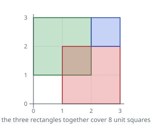

# Rectangle Union Area

## Description

A list `rectangles` holds axis-aligned rectangles, each written as four numbers
`[x1, y1, x2, y2]`: the corner nearest the origin is at `(x1, y1)` and the one
opposite it at `(x2, y2)`.

Work out how much of the plane the rectangles cover between them. Ground
belonging to more than one rectangle contributes its area once, not once per
rectangle sitting on it.

The figure can be enormous, so return it reduced modulo `10^9 + 7` rather than
in full.

### Example 1

```text
Input: rectangles = [[0,1,2,3],[1,0,3,2],[2,2,3,3]]
Output: 8
Explanation: The first two rectangles are 2 by 2 and share the unit square
between (1,1) and (2,2). The third is a unit square that only touches the
others along edges. That leaves 4 + 4 + 1 - 1 covered.
```



### Example 2

```text
Input: rectangles = [[0,0,4,1],[1,0,2,4]]
Output: 7
Explanation: A wide flat rectangle and a tall thin one cross in the unit square
between (1,0) and (2,1). Their areas are 4 each, and the crossing is counted
once: 4 + 4 - 1.
```

### Example 3

```text
Input: rectangles = [[0,0,1000000000,999999999]]
Output: 56
Explanation: One rectangle, no overlap to resolve, but its area is far past
what fits in the answer: 999999999000000000 leaves a remainder of 56 when
divided by 10^9 + 7.
```

### Constraints

- `1 <= rectangles.length <= 200`
- Each entry has exactly `4` numbers
- Every coordinate is an integer in `[0, 10^9]`
- `x1 <= x2` and `y1 <= y2` within an entry
- No entry is degenerate: each rectangle encloses a positive area

## Hints

### Hint 1

Coordinates run to `10^9`, but only `200` rectangles supply them, so at most
`400` distinct values appear on each axis. Those values are the only places
where anything changes.

### Hint 2

Cut the plane along every supplied coordinate. Inside one of the resulting
cells no rectangle boundary passes, so a cell is either entirely covered or
entirely bare — a single flag per cell describes it.

### Hint 3

Flagging is idempotent, which is what makes double counting impossible: a cell
under five rectangles is still one flagged cell. Add up the true widths times
true heights of the flagged cells at the end, reducing as you go.
