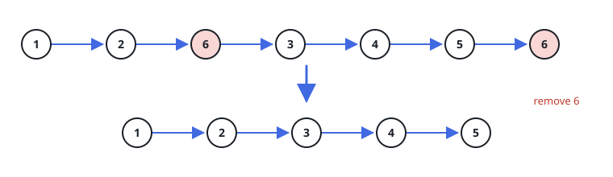

# Filter List by Value

## Description

You are given the `head` of a singly linked list along with a target integer
`val`. Build a new list that keeps every node whose value is different from
`val`, preserving the original order, and drop every node whose value equals
`val`. Return the head of the surviving list (`null`/`nil` if nothing
survives).

### Example 1



```text
Input: head = [1,2,6,3,4,5,6], val = 6
Output: [1,2,3,4,5]
```

### Example 2

```text
Input: head = [3,1,2,1], val = 1
Output: [3,2]
Explanation: Both nodes holding 1 are removed; the remaining nodes 3 and 2
keep their original relative order.
```

### Example 3

```text
Input: head = [], val = 7
Output: []
Explanation: An empty list has nothing to filter, so the result is also
empty.
```

### Constraints

- The number of nodes in the list is in the range `[0, 10⁴]`.
- `1 <= Node.val <= 50`
- `0 <= val <= 50`
