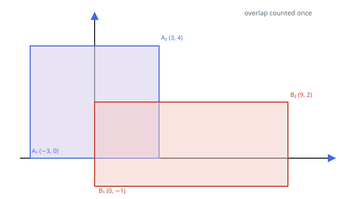

# Combined Rectangle Coverage

## Description

You are given two axis-aligned rectangles sitting on the same 2D plane.
Each rectangle is described by its lower-left corner and its upper-right
corner. Report the total area of the plane that at least one of the two
rectangles covers — overlapping ground should only be counted once.

The first rectangle runs from `(ax1, ay1)` at its lower-left to
`(ax2, ay2)` at its upper-right. The second rectangle runs from
`(bx1, by1)` to `(bx2, by2)` the same way.

### Example 1



```text
Input: ax1 = -3, ay1 = 0, ax2 = 3, ay2 = 4, bx1 = 0, by1 = -1, bx2 = 9, by2 = 2
Output: 45
```

### Example 2

```text
Input: ax1 = -1, ay1 = -1, ax2 = 1, ay2 = 1, bx1 = 0, by1 = 0, bx2 = 3, by2 = 3
Output: 12
```

The two squares overlap in the unit square from `(0, 0)` to `(1, 1)`, so
the combined footprint is `4 + 9 - 1 = 12`.

### Constraints

- `-10⁴ <= ax1 <= ax2 <= 10⁴`
- `-10⁴ <= ay1 <= ay2 <= 10⁴`
- `-10⁴ <= bx1 <= bx2 <= 10⁴`
- `-10⁴ <= by1 <= by2 <= 10⁴`
