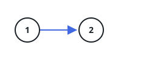

# List Symmetry Check

## Description

You are given the `head` of a singly linked list. Determine whether the
sequence of values it holds reads the same forward and backward, and
return `true` if it does or `false` otherwise.

### Example 1


```text
Input: head = [1,2,2,1]
Output: true
```

### Example 2



```text
Input: head = [1,2]
Output: false
```

### Constraints

- The number of nodes in the list is in the range `[1, 10⁵]`.
- `0 <= Node.val <= 9`

### Follow-up

Could you do it in `O(n)` time and `O(1)` space?
