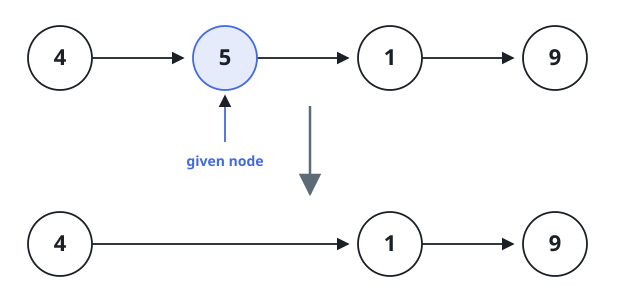
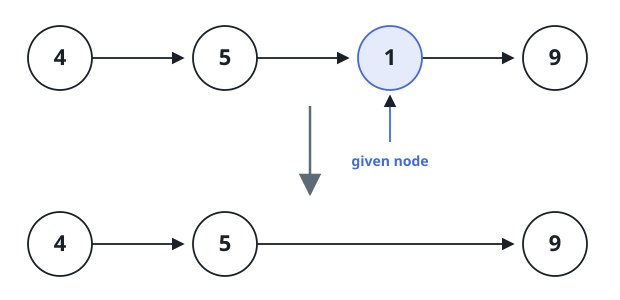

# Erase a Named Node

## Description

You are handed a singly-linked list and one specific node inside it,
`node`, to erase — but not the list's `head`, and not any pointer to
whatever comes before `node`. Every value in the list is distinct, and
`node` is guaranteed to sit somewhere before the last node, never at the
tail.

"Erase" here means the observable list changes as if `node` had been
unlinked normally: its value must no longer appear anywhere in the list,
the list must shrink by exactly one node, and everything before and
after `node` must keep its original relative order. How you accomplish
that internally is up to you.

On LeetCode this problem hands you a live pointer to the node itself and
checks the list by walking from an untouched head afterward. Here lists
travel across the wire as plain value arrays, so a bare pointer to a
buried node can't be passed as an argument. Instead your function
receives the full `head` and, as `node`, the _value_ stored in the node
to erase (values are unique, so this pins down exactly one node). Erase
that node in place and return `head`; the array your returned list
decodes to is what gets checked.

### Example 1



```text
Input: head = [4,5,1,9], node = 5
Output: [4,1,9]
Explanation: The node holding 5 is erased; the surrounding nodes 4, 1, 9
keep their original order.
```

### Example 2



```text
Input: head = [4,5,1,9], node = 1
Output: [4,5,9]
Explanation: The node holding 1 is erased; 4, 5, 9 keep their original
order.
```

### Constraints

- The number of nodes in the given list is in the range `[2, 1000]`.
- `-1000 <= Node.val <= 1000`
- The value of each node in the list is unique.
- `node` names a node that appears in the list and is not the last node.
