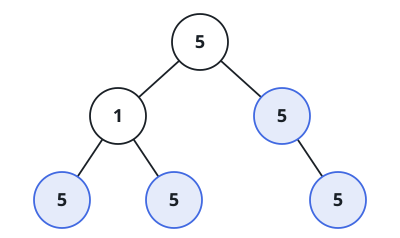

# Uniform Subtree Count

## Description

Call a subtree **uniform** when every node inside it — the subtree's
root and all of its descendants — carries the same value. A single node
on its own is trivially uniform, since it has no other node to disagree
with.

Given the `root` of a binary tree, count how many of its subtrees
(counting each node as the root of its own subtree) are uniform.

### Example 1



```text
Input: root = [5,1,5,5,5,null,5]
Output: 4
```

### Example 2

```text
Input: root = [1,1,1,1,1,1,2]
Output: 5
Explanation: All four leaves are trivially uniform on their own,
including the one holding `2`. The node just above the two `1`-leaves on
the left is also uniform, for a fifth match. Its mirror on the right
fails, because one of its two children is that `2`-leaf, and so does the
root, since a subtree can only be uniform when both of its own children's
subtrees are.
```

### Example 3

```text
Input: root = [1]
Output: 1
```

### Constraints

- The tree holds at most `1000` nodes.
- `-1000 <= Node.val <= 1000`

## Hints

### Hint 1

Work bottom-up: a subtree is uniform exactly when both of its children's
subtrees are uniform and every existing child shares the root's value.
An absent child can never break that test, so an empty subtree counts as
uniform by convention, even though it is never itself counted.
