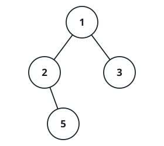

# Root-to-Leaf Trails

## Description

You are given the `root` of a binary tree. List every trail that starts
at the root and ends at a leaf, writing each trail as the values along it
joined with `->`.

To make the result deterministic, list the trails in the order a
depth-first walk reaches the leaves, always descending into the left
child before the right child at each node.

A leaf is any node that has neither a left nor a right child.

### Example 1



```text
Input: root = [1,2,3,null,5]
Output: ["1->2->5","1->3"]
```

### Example 2

```text
Input: root = [9]
Output: ["9"]
```

### Constraints

- The number of nodes in the tree is in the range `[1, 100]`.
- `-100 <= Node.val <= 100`
