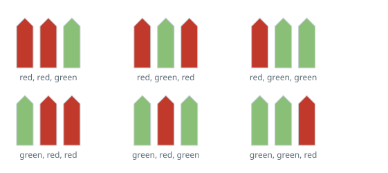

# Picket Coloring Count

## Description

A fence has `n` pickets in a row, and you have `k` colors available. Paint
every picket with exactly one color so that no three consecutive pickets
share the same color (two in a row matching is fine; three is not).
Given `n` and `k`, return how many distinct paintings satisfy this rule.

### Example 1



```text
Input: n = 3, k = 2
Output: 6
Explanation: There are 8 ways to color 3 pickets with 2 colors total, but
painting all three the same color (2 of those 8 ways) creates a run of
three matching pickets, which is forbidden. The remaining 6 are valid.
```

### Example 2

```text
Input: n = 2, k = 4
Output: 16
Explanation: With only 2 pickets, no coloring can ever produce a run of
three, so every one of the 4 * 4 = 16 color assignments is valid.
```

### Example 3

```text
Input: n = 5, k = 3
Output: 180
```

### Constraints

- `1 <= n <= 50`
- `1 <= k <= 10⁵`
- The testcases are generated such that the answer is in the range
  `[0, 2³¹ - 1]` for the given `n` and `k`.
