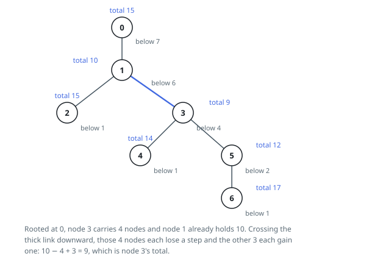

# Solutions — Tree Distance Totals

## Rerooting with subtree sizes

One traversal answers for one node, so `n` traversals answer for all of them at
a cost of `O(n^2)` — hopeless at thirty thousand nodes. The way out is to solve
node `0` honestly and then _derive_ every other answer from a neighbour's,
paying constant time per edge. Node `0` becomes the root, and a queue-driven
sweep records each node's parent together with an order in which parents always
precede their children; using a queue rather than recursion keeps a long
skinny tree from exhausting the interpreter's stack.

Walking that order backwards visits children before parents, which is what the
first accumulation needs. Two arrays fill in together: `sub[u]` counts the
nodes hanging below `u` (including `u`), and `dist[u]` totals the distances
from `u` down to exactly those nodes. Both come from a child `v` in one line —
`v` passes up `dist[v]`, plus one extra step for each of the `sub[v]` nodes it
covers, because reaching any of them from `u` means first crossing the edge
`u — v`. When the sweep finishes, `dist[0]` is already the true answer for the
root: at the root, "below" means "everywhere".

The second sweep runs the order forwards, converting a finished answer into a
child's. Slide the root from `u` to its child `v` and the tree splits in two
along that one edge. The `sub[v]` nodes on the far side each come one step
nearer; the `n - sub[v]` nodes on the near side each go one step farther, so
`ans[v] = ans[u] - sub[v] + (n - sub[v])`. On the seven-node example, node `3`
covers `4` nodes and node `1` has settled at `10`, so node `3` lands at
`10 - 4 + 3 = 9` — the smallest total in the tree, which matches where it sits.
Parents are always settled before their children in this order, so every
right-hand side is ready when it is read.

**Complexity:** `O(n)` time, `O(n)` space.
