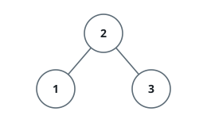
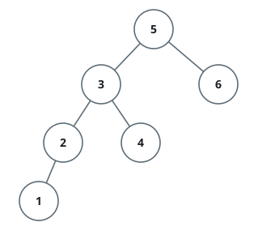

# Next Greater BST Node

## Description

You are given the `root` of a binary search tree along with the value of
some node `p` that exists in the tree. Return the node that would come
right after `p` in an in-order walk of the tree — the node holding the
smallest value that is still strictly greater than `p`'s value. Return
`null` if no such node exists (i.e., `p` holds the largest value in the
tree).

On the original platform `p` and the return value are passed as node
references. Here the tree crosses the wire as a level-order array, so a
node cannot be handed over directly: the judge instead identifies `p` by
its value (all values in the tree are distinct), and the node you return
also crosses the wire as its own subtree in level-order form — an empty
array means there is no such node.

### Example 1



```text
Input: root = [2,1,3], p = 1
Output: [2,1,3]
Explanation: 1's in-order successor node is 2. Note that both p and the
return value is of TreeNode type.
```

### Example 2



```text
Input: root = [5,3,6,2,4,null,null,1], p = 6
Output: []
Explanation: There is no in-order successor of the current node, so the
answer is null.
```

### Constraints

- The number of nodes in the tree is in the range `[1, 10⁴]`.
- `-10⁵ <= Node.val <= 10⁵`
- All Nodes will have unique values.
