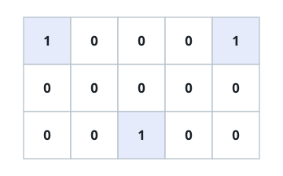

# Optimal Rendezvous Point

## Description

You are given an `m x n` binary grid `grid`, where each cell holding a
`1` is the home of one person. All of these people want to meet at a
single cell of the grid, and each of them will walk there along the
grid (moving between horizontally or vertically adjacent cells one step
at a time), so the distance any one of them travels to a chosen meeting
cell is the Manhattan distance between their home and that cell:
`distance(p1, p2) = |p2.x - p1.x| + |p2.y - p1.y|`.

Choose a meeting cell that makes the sum of everyone's travel distances
as small as possible, and return that minimum total distance.

### Example 1



```text
Input: grid = [[1,0,0,0,1],[0,0,0,0,0],[0,0,1,0,0]]
Output: 6
Explanation: The three homes sit at (0,0), (0,4), and (2,2). Meeting at
(0,2) costs 2 + 2 + 2 = 6, which is the smallest total distance any
cell achieves.
```

### Example 2

```text
Input: grid = [[1],[0],[1],[1]]
Output: 3
Explanation: The three homes sit at (0,0), (2,0), and (3,0), all in the
same column. Meeting at (2,0) costs 2 + 0 + 1 = 3.
```

### Constraints

- `m == grid.length`
- `n == grid[i].length`
- `1 <= m, n <= 200`
- `grid[i][j]` is either `0` or `1`.
- The grid contains at least two homes.

## Hints

### Hint 1

Solve the problem along a single line first — one row or one column of
homes. Once you know how to place the meeting point optimally in one
dimension, how does that extend to a full 2-D grid?
