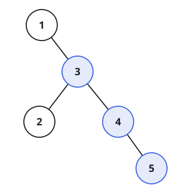
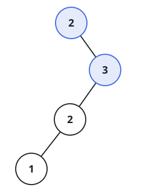

# Longest Rising Tree Chain

## Description

Given the `root` of a binary tree, find the longest chain of nodes that
forms a strictly increasing-by-one path, and return the number of nodes
in that chain.

A chain here means a sequence of nodes where each one is a direct
child of the previous node — the walk only ever moves downward from a
node to one of its children, never back up to a parent — and each
child's value is exactly one more than its parent's value. The chain
may start at any node in the tree, not just the root.

### Example 1



```text
Input: root = [1,null,3,2,4,null,null,null,5]
Output: 3
Explanation: The longest rising chain is 3-4-5, three nodes long.
```

### Example 2



```text
Input: root = [2,null,3,2,null,1]
Output: 2
Explanation: The longest rising chain is 2-3, two nodes long. The path
3-2-1 does not qualify, since values must increase going down the tree,
not decrease.
```

### Constraints

- The number of nodes in the tree is in the range `[1, 3 * 10⁴]`.
- `-3 * 10⁴ <= Node.val <= 3 * 10⁴`
