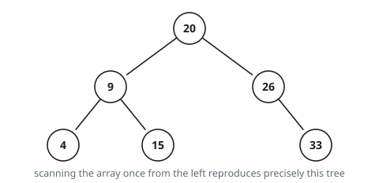

# Rebuild BST From Preorder

## Description

The array `preorder` records the values of a binary search tree in the order a
preorder walk reports them: a node is reported before everything hanging below
its left link, and that whole left side is reported before the right side.

Rebuild the tree from that array and return its root.

Recall what makes the tree a search tree: every value below a node's left link
is smaller than the node's value, and every value below its right link is
larger. The values are all different, and the array is always a genuine
preorder walk of one such tree, so exactly one tree matches it.

### Example 1

```text
Input: preorder = [20,9,4,15,26,33]
Output: [20,9,26,4,15,null,33]
```



### Example 2

```text
Input: preorder = [3,8,5]
Output: [3,null,8,5]
```

### Example 3

```text
Input: preorder = [2,4,6,8]
Output: [2,null,4,null,6,null,8]
```

### Constraints

- `preorder` contains between 1 and 100 values.
- Each value lies between 1 and 1000.
- No value is repeated.

## Hints

### Hint 1

The opening entry has to be the root. Everything smaller than it forms one
unbroken run immediately after it — the entire left side — and everything
larger follows.

### Hint 2

Locating where that run ends by scanning is wasteful. Instead pass a permitted
range down the recursion and look at the next unconsumed entry: take it only
when it lies inside the range, and otherwise report an empty subtree.

### Hint 3

Taking a value `v` under range `(low, high)` splits it: the left call may use
`(low, v-1)` and the right call `(v+1, high)`. Since a rejected value is left
in place, the ancestor whose range does admit it will pick it up.
