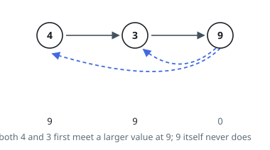
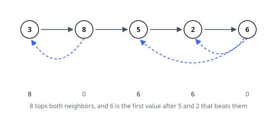

# Next Greater, List Nodes

## Description

You are given `head`, the first node of a linked list. Walking forward from it
visits `n` values in order.

For each node, its **next greater value** is the value of the earliest node
after it that holds a strictly larger number. A node with no such follower has
next greater value `0`.

Return an array `answer` of length `n`, where `answer[i]` is the next greater
value of the `i`th node counting from 1.

### Example 1

```text
Input: head = [4,3,9]
Output: [9,9,0]
```



### Example 2

```text
Input: head = [3,8,5,2,6]
Output: [8,0,6,6,0]
```



### Constraints

- The number of nodes in the list is `n`.
- `1 <= n <= 10^4`
- `1 <= Node.val <= 10^9`

## Hints

### Hint 1

Keep a stack of positions whose values descend from bottom to top — they are
exactly the positions still waiting for a larger value.

### Hint 2

A linked list gives you no indexing, so first walk it once into an array of
values; then, as each new value arrives, pop every stacked position it beats
and stamp the new value there.

### Hint 3

Positions left on the stack when the walk ends never meet a larger value — their
answers were `0` from the start.
