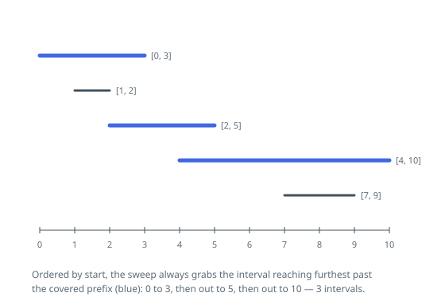

# Solutions — Fewest Segments to Cover a Range

## Greedy farthest-reach jumps

Order the intervals by their left endpoint and grow the covered part of the line
from the left. Let `covered` be the right end of the prefix `[0, covered]` that
the chosen intervals already handle. Only an interval beginning at or before
`covered` can extend that prefix without leaving a hole, and among those the one
whose right endpoint sits furthest right is always a safe choice: any valid
selection has to contain some interval crossing the frontier, and replacing that
interval with the furthest-reaching one covers at least as much and constrains
nothing later. So each step is a jump — count one interval, move `covered` out
to the best reach available.

Implementing it needs one pass, not one pass per jump. A cursor into the sorted
list only ever moves forward: before each jump, advance it over every interval
whose start is at most `covered`, keeping the largest right endpoint seen in
`farthest`. Those intervals are consumed for good — an interval usable now stays
usable later, and its reach is already folded into `farthest`.

Two outcomes end the loop. If `covered` reaches `span`, the count is the answer.
If the scan finishes with `farthest` still equal to `covered`, then nothing in
the whole list crosses that point; intervals further along start later still, so
the gap is permanent and the answer is `-1`. That single test also catches the
case where no interval starts at 0, which fails on the very first pass. An
interval overshooting `span` is harmless, since the loop stops as soon as the
prefix is long enough.

**Complexity:** `O(n log n)` time (the sort dominates the linear scan), `O(n)` space for the sorted copy.
