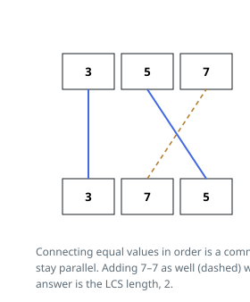

# Solutions — Most Non-Crossing Matches

## Longest common subsequence with rolling rows

Strip the geometry away and the task is the longest common subsequence wearing
a costume. A drawable match set pairs equal entries whose positions rise in
lockstep along both rows — which is exactly a common subsequence — and any
common subsequence can be linked pair by pair without a crossing. The answer is
therefore the LCS length of `nums1` and `nums2`.

The prefix DP survives on two rows: `prev` carries the results for the previous
prefix of `nums1`, and each incoming element `a` lays down a fresh `cur` row
across `nums2`. On a hit (`a == nums2[j - 1]`) the pairing is never worse than
dropping either entry, so `cur[j] = prev[j - 1] + 1`; otherwise the survivor is
the better of discarding `a` or discarding `nums2[j - 1]`:
`max(cur[j - 1], prev[j])`. `cur[0]` remains 0 — an empty prefix matches
nothing.

Holding just the finished row and the row under construction shrinks the table
from the full `m x n` grid to a row plus a scratch row, and when the last row
lands, `prev[n]` is the answer.

For the rows `[3, 5, 7]` over `[3, 7, 5]`, matching the 3s then the 5s gives two
parallel segments; insisting on the 7s as well would send one segment through
the other, so two is the maximum.

**Complexity:** `O(m * n)` time, `O(n)` space for the two rows over `nums2`.
