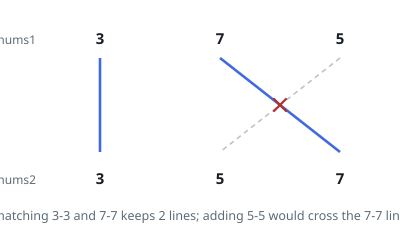

# Most Non-Crossing Matches

## Description

You are given two integer arrays `nums1` and `nums2`. Write their entries in
order on two parallel rows, `nums1` on top and `nums2` below.

A **match** joins one entry of the top row to an equal entry of the bottom row.
A set of matches is drawable when no two of its joining segments cross, even at
a shared endpoint — which also means each entry takes part in at most one match.

Return the largest number of matches a drawable set can contain.

### Example 1

```text
Input: nums1 = [3,7,5], nums2 = [3,5,7]
Output: 2
Explanation: Match the 3s and the 7s. A third match on the 5s is impossible:
the top 5 sits right of the top 7 while the bottom 5 sits left of the bottom 7,
so the two segments would cross.
```



### Example 2

```text
Input: nums1 = [4,8,6,4,8], nums2 = [9,8,4,6,8,4]
Output: 3
Explanation: 8, 6, 8 can be matched in order in both rows.
```

### Example 3

```text
Input: nums1 = [5,9,12,9,5], nums2 = [5,8,11,5,9]
Output: 2
Explanation: Repeated values give choices: 5, 9 from the top row matches
5, 9 from the bottom, and no third entry can join without a crossing.
```

### Constraints

- `1 <= nums1.length, nums2.length <= 500`
- `1 <= nums1[i], nums2[j] <= 2000`

## Hints

### Hint 1

Suppose an oracle `best(i, j)` knew the most drawable matches using only
`nums1[i:]` and `nums2[j:]`. How would it be built from answers further right?

### Hint 2

When `nums1[i] == nums2[j]`, taking that match never does worse than skipping
either entry.

### Hint 3

Underneath the geometry this is the longest common subsequence of the two rows.
