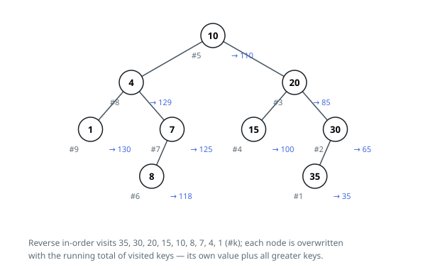

# Solutions — Search Tree Suffix Sums

## Reverse in-order running sum

In a search tree, the ordinary in-order walk — left, node, right — emits keys in
ascending order. Walk it backwards, visiting the right subtree first and the
left last, and the keys come out largest first. When this reversed walk steps
onto a node, every strictly larger key in the tree has already passed by, which
is precisely the set the node's new value has to cover.

The walk carries `total`, the sum of everything visited so far. Arriving at a
node it recurses right, folds `current.val` into `total`, and straight away
overwrites `current.val` with the running total — the node's own key plus every
key above it. Turning left afterwards hands the accumulated sum to the smaller
keys, each of which adds an even longer tail of larger values to its own.

Nothing is rebuilt: values are swapped in place, the structure stays exactly as
given, and the root comes back out. A one-node tree receives its own key back,
and a chain — all keys on one side — is the deepest the recursion ever goes.

**Complexity:** `O(n)` time, `O(h)` space for the recursion stack (`O(n)` worst
case on a chain).
