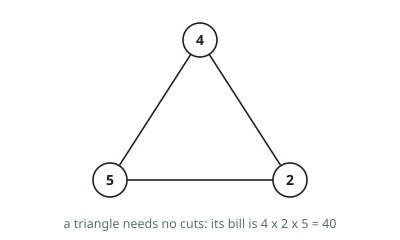
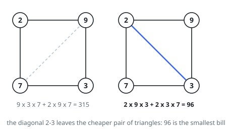
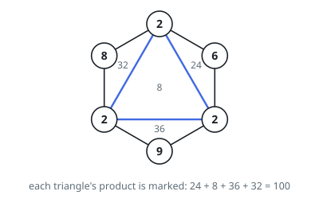

# Cheapest Polygon Triangulation

## Description

A convex polygon has `n` corners, listed clockwise, and the integer array
`values` gives the number written at each corner: `values[i]` belongs to corner
`i`.

Draw non-crossing diagonals between corners until every region left inside the
polygon is a triangle. However you do it, exactly `n - 2` triangles result. A
triangle is billed at the product of the three numbers at its corners, and the
bill for the whole drawing is the sum over its triangles.

Return the smallest bill over all ways of cutting the polygon up.

### Example 1

```text
Input: values = [4,2,5]
Output: 40
Explanation: Three corners are already a triangle, so no diagonal is needed
and the only bill is 4 * 2 * 5 = 40.
```



### Example 2

```text
Input: values = [2,9,3,7]
Output: 96
Explanation: A quadrilateral admits one diagonal, and there are two to pick
from. Joining corners 0 and 2 makes the triangles (2,9,3) and (2,3,7), billed
54 + 42 = 96. Joining corners 1 and 3 instead makes (9,3,7) and (2,9,7),
billed 189 + 126 = 315, so 96 wins.
```



### Example 3

```text
Input: values = [2,6,2,9,2,8]
Output: 100
Explanation: Wiring the three corners that hold a 2 to each other peels off
the three expensive corners one at a time and leaves a cheap triangle in the
middle: 24 + 36 + 32 + 8 = 100.
```



### Constraints

- `n` is `values.length`, and `3 <= n <= 50`
- every corner number satisfies `1 <= values[i] <= 100`

## Hints

### Hint 1

Look at one side of the polygon — say the one joining the last corner back to
the first. In any finished drawing it borders exactly one triangle. Which
corner is the third one?

### Hint 2

Whatever that third corner turns out to be, it cuts the rest of the polygon
into two pieces that share only it, and neither piece constrains the other.
Both pieces are again polygons spanning a contiguous run of corners.

### Hint 3

So the quantity to tabulate is the cheapest drawing for the piece running from
corner `i` to corner `j`, over every pair `i < j`. A run of fewer than three
corners holds no triangle and costs nothing; widen the runs a step at a time so
that both pieces are already known when you need them.
