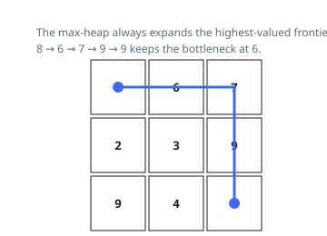

# Solutions — Widest Grid Path

## Greedy Max-Heap Best-First Search

Wideness has the property best-first search feeds on: among all cells on
the current frontier, stepping onto the largest one can only help, since it
either lifts the running minimum or leaves it alone, while any competing
route to the far corner must cross the frontier somewhere no higher than
the cell just chosen. Swap min for max in Dijkstra and let the "distance"
be the running minimum; the first time the goal cell comes off the heap,
its recorded minimum is the widest walk in the grid.

Concretely, a max-heap of negated cell values starts at the origin, whose
value seeds the running best. Each pop folds its value into that best with
a `min`; popping the bottom-right cell returns the best right there. Every
expansion pushes the four neighbours that are inside the grid and unseen,
and marks them seen at push time, so no cell ever enters the heap twice.

Always taking the most valuable frontier cell is what both proves and
speeds the search: the goal is reached along a walk whose bottleneck is the
maximum over all walks, with no exploration ordered by distance. A 1 x 1
grid answers with its lone value on the first pop, and the origin's own
value honestly caps everything — start on a 0 and no walk is wider than 0.
On the first example the walk runs `8 → 6 → 7 → 9 → 9` and the bottleneck
settles at 6 the moment the 6 is stepped on.

**Complexity:** `O(mn log(mn))` time, `O(mn)` space.
