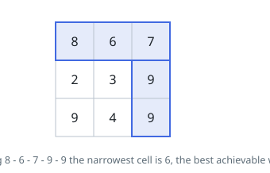
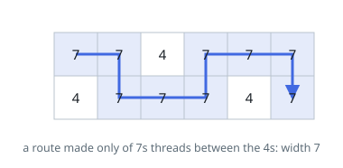
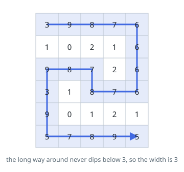

# Widest Grid Path

## Description

Given an `m x n` integer matrix `grid` of non-negative values, walk from the
top-left cell `(0, 0)` to the bottom-right cell `(m - 1, n - 1)`, moving one
cell at a time in the four cardinal directions.

A walk's width is the smallest value among the cells it visits. Return the
largest width any walk can achieve.

For instance, the walk `8 -> 6 -> 7 -> 9 -> 9` has width `6`.

### Example 1

```text
Input: grid = [[8,6,7],[2,3,9],[9,4,9]]
Output: 6
Explanation: Across the top row and down the right column the narrowest
cell is the 6, and every other route is capped lower still.
```



### Example 2

```text
Input: grid = [[7,7,4,7,7,7],[4,7,7,7,4,7]]
Output: 7
```



### Example 3

```text
Input: grid = [[3,9,8,7,6],[1,0,2,1,6],[9,8,7,2,6],[3,1,8,7,6],[9,0,1,2,1],[5,7,8,9,5]]
Output: 3
```



### Constraints

- `m == grid.length`
- `n == grid[i].length`
- `1 <= m, n <= 100`
- `0 <= grid[i][j] <= 10⁹`

## Hints

### Hint 1

A walk is capped by its narrowest cell, so the question is really: how high
can that cap go before the corners stop being reachable?

### Hint 2

Consider admitting cells in falling order of value — start with nothing
usable and switch cells on, biggest first.

### Hint 3

The moment the two corners become connected through admitted cells, stop:
the value of the cell admitted last is the answer.

### Hint 4

That connectivity test is incremental, which is exactly what a
disjoint-set forest is for — or, equivalently, grow a region best-first,
always expanding the highest-valued cell on the frontier and carrying the
running minimum along.
