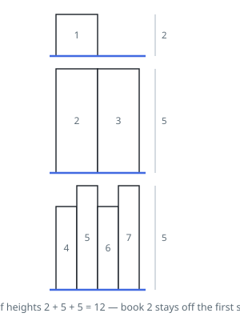

# Minimum Bookcase Height

## Description

You are given `books`, where `books[i] = [thickness, height]` describes the
`i`-th book, and an integer `shelfWidth` — the usable width of every shelf
in a bookcase.

The books are shelved in the given order, first to last. Each shelf takes a
consecutive run of books whose thicknesses together do not exceed
`shelfWidth`; a new shelf is started whenever you choose. A shelf is as
tall as the tallest book standing on it, and the bookcase's height is the
sum over its shelves.

Return the smallest height the bookcase can have once every book is placed.

For `books = [[2,2],[2,5]]` and `shelfWidth = 2`, the books cannot share a
shelf, so the answer is `2 + 5`.

### Example 1

```text
Input: books = [[2,2],[2,5],[2,5],[1,4],[1,5],[1,4],[1,5]], shelfWidth = 4
Output: 12
Explanation:
Shelves {1}, {2,3}, {4,5,6,7} have heights 2 + 5 + 5 = 12.
Shelving book 2 together with book 1 is legal width-wise but raises that
shelf to 5, which costs more overall.
```



### Example 2

```text
Input: books = [[3,4],[2,6],[2,2]], shelfWidth = 7
Output: 6
Explanation: All three fit on one shelf, whose height is the tallest book.
```

### Example 3

```text
Input: books = [[4,2],[4,1],[4,3]], shelfWidth = 8
Output: 5
Explanation: All three cannot share a shelf, so two are needed; the short
middle book rides with either neighbour, giving 2 + 3.
```

### Constraints

- `1 <= books.length <= 1000`
- `1 <= books[i][0] <= shelfWidth <= 1000`
- `1 <= books[i][1] <= 1000`

## Hints

### Hint 1

Because the order is fixed, a shelving is nothing more than a sequence of
cut points between books — and the cost of a stretch between two cuts is
the tallest book in it.

### Hint 2

Let `dp(i)` be the best height achievable for the suffix starting at book
`i`; the first shelf of that suffix is some run `i..j-1`.

### Hint 3

Each candidate run contributes its maximum height plus `dp(j)`, and the run
can only grow while its thickness sum stays within `shelfWidth` — so `dp(i)`
is the minimum over those few `j`.
