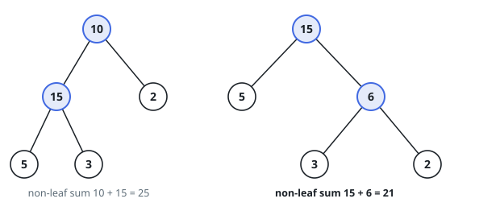
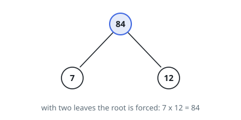

# Minimum Non-Leaf Sum

## Description

Given an array `leaves` of positive integers, build a full binary tree —
every node has either `0` or `2` children — whose leaves, read left to
right, carry the entries of `leaves` in order.

Each internal node's value is the product of the largest leaf found in its
left subtree and the largest leaf found in its right subtree.

Among all trees satisfying this, return the least possible sum of the
internal nodes' values. That sum is guaranteed to fit in a 32-bit signed
integer.

### Example 1

```text
Input: leaves = [5,3,2]
Output: 21
Explanation: Two shapes exist. Joining 5 with 3 first costs 5·3 = 15 and a
root of 5·2 = 10, totalling 25; joining 3 with 2 first costs 3·2 = 6 and a
root of 5·3 = 15, totalling 21.
```



### Example 2

```text
Input: leaves = [7,12]
Output: 84
Explanation: With two leaves there is only one tree; its root is 7·12.
```



### Example 3

```text
Input: leaves = [2,9,1,8]
Output: 98
Explanation: Peeling the 2 off first, then joining 9, 1, 8, costs
2·9 + 9·8 + 1·8 = 98, and no other split tree does better.
```

### Constraints

- `2 <= leaves.length <= 40`
- `1 <= leaves[i] <= 15`
- The answer fits in a 32-bit signed integer.

## Hints

### Hint 1

In any such tree the leaves of a subtree are a consecutive slice of the
array, so a tree is a recursive sequence of cuts.

### Hint 2

For a slice, the cost of one cut is (largest leaf left of the cut) times
(largest leaf right of the cut), plus the best costs of both halves — which
is exactly what an interval DP over slices computes.

### Hint 3

Precompute the largest leaf of every slice so each candidate cut costs
O(1) to evaluate.
