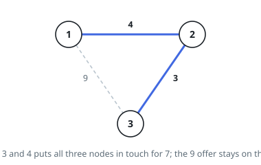
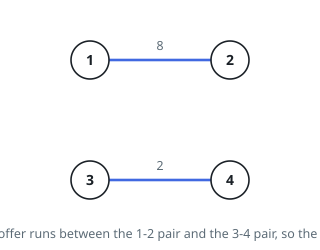

# Cheapest Spanning Network

## Description

There are `n` nodes numbered `1` through `n`, together with a catalogue of
links you may buy. Entry `links[i] = [a, b, w]` offers one undirected link
joining node `a` and node `b` at price `w`, and you may install any subset of
the catalogue.

Install links so that every node reaches every other node along installed
links, spending as little as possible, and return what you spend. When no
subset of the catalogue leaves all `n` nodes mutually reachable, return `-1`.

### Example 1

```text
Input: n = 3, links = [[1,2,4],[1,3,9],[2,3,3]]
Output: 7
Explanation: Buy 2-3 for 3 and 1-2 for 4. Every node now reaches every other,
and the 9 link would only duplicate a route that already exists.
```



### Example 2

```text
Input: n = 4, links = [[1,2,8],[3,4,2]]
Output: -1
Explanation: The catalogue offers nothing at all between {1,2} and {3,4}, so
node 1 can never reach node 3, however much is spent.
```



### Example 3

```text
Input: n = 4, links = [[1,2,2],[2,3,7],[3,4,1],[1,4,5],[2,4,3]]
Output: 6
Explanation: 3-4 at 1, 1-2 at 2 and 2-4 at 3 add up to 6 and already join all
four nodes. Each remaining offer would close a cycle instead of reaching
anyone new.
```

### Constraints

- `1 <= n <= 10^4`
- `1 <= links.length <= 10^4`
- `links[i].length == 3`
- `1 <= a, b <= n` with `a != b`
- `0 <= w <= 10^5`

## Hints

### Hint 1

A cheapest sufficient purchase never contains a cycle: delete any single link
of a cycle and everything still reaches everything, for less money. So what
you are pricing is a spanning tree of least total weight.

### Hint 2

Walk the catalogue in increasing price and buy a link whenever its two
endpoints are not already joined by what you have bought. Cutting the nodes
into two sides, the cheapest link crossing that cut is always safe to buy,
which is why the greedy order is not just plausible but correct.

### Hint 3

"Already joined?" gets asked once per offer, so keep the groups in a
disjoint-set structure. Buying a link merges the two groups its endpoints
belong to; testing an offer is two root lookups.

### Hint 4

Begin with `n` separate groups and let each purchase drop the count by one.
If the catalogue runs out while two or more groups remain, some node was
unreachable from the rest and the answer is `-1`.
