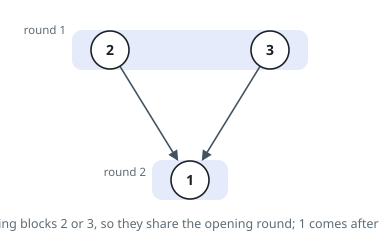
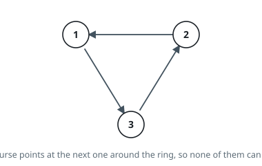

# Fewest Course Rounds

## Description

A catalogue holds `n` courses labelled `1` through `n`. Each pair
`precedence[i] = [a, b]` says that course `a` must be finished before course
`b` may begin; the same pair never appears twice.

Courses are taken in rounds. A round may contain as many courses as you like,
provided every prerequisite of each of them was finished in an earlier round.
Return the smallest number of rounds that gets all `n` courses finished, or
`-1` if some course can never be reached.

### Example 1

```text
Input: n = 3, precedence = [[2,1],[3,1]]
Output: 2
Explanation: Courses 2 and 3 answer to nobody, so both fit in the opening
round. Course 1 waits for both and takes the second round alone.
```



### Example 2

```text
Input: n = 3, precedence = [[1,3],[3,2],[2,1]]
Output: -1
Explanation: Course 1 waits on 2, which waits on 3, which waits on 1. None of
the three ever becomes eligible, so no round can even open.
```



### Example 3

```text
Input: n = 6, precedence = [[1,2],[1,3],[2,4],[3,4],[4,5],[4,6]]
Output: 4
Explanation: Round one takes course 1; round two takes 2 and 3 side by side;
round three takes 4; round four takes 5 and 6 together. Widening the
catalogue mid-way does not add rounds — only the longest chain does.
```

### Constraints

- `1 <= n <= 5000`
- `1 <= precedence.length <= 5000`
- `precedence[i].length == 2`
- `1 <= a, b <= n` and `a != b`
- No two entries of `precedence` are the same pair.

## Hints

### Hint 1

Read the pairs as arrows in a directed graph over the courses. If the arrows
close a loop, every course on that loop is waiting on itself and the answer
is `-1` — so the first question is whether the graph is acyclic.

### Hint 2

For an acyclic graph, the round a course lands in is one more than the latest
round among its prerequisites. The total is therefore the number of courses on
the longest chain of arrows.

### Hint 3

Count, for every course, how many prerequisites it still waits on. The courses
sitting at zero form a round; finishing them decrements the counts of their
successors, and whoever drops to zero forms the next round.

### Hint 4

Take a snapshot of the queue length before draining it, so one pass of the
outer loop is one whole round rather than one course. If the courses drained
across all rounds number fewer than `n`, a loop swallowed the rest.
