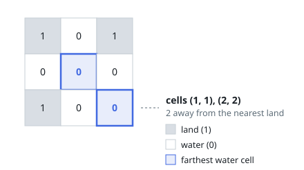
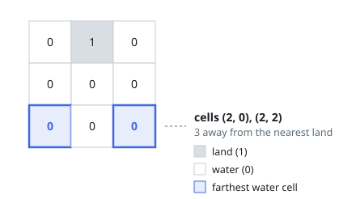

# Greatest Distance to Land

## Description

You are given an `n x n` grid where each cell holds `0` or `1`: `0` is water
and `1` is land. Find a water cell whose distance to the closest land cell is
as large as possible, and report that distance. If the grid has no land or no
water at all, report `-1`.

Distance here is Manhattan distance: for cells `(x0, y0)` and `(x1, y1)` it
is `|x0 - x1| + |y0 - y1|`.

### Example 1

```text
Input: grid = [[1,0,1],[0,0,0],[1,0,0]]
Output: 2
Explanation: Land occupies three corners. The cells (1, 1) and (2, 2) each
lie 2 steps from their nearest land, and nothing is farther.
```



### Example 2

```text
Input: grid = [[0,1,0],[0,0,0],[0,0,0]]
Output: 3
Explanation: The only land sits at (0, 1). The bottom corners (2, 0) and
(2, 2) are both 3 steps away from it.
```



### Constraints

- `n == grid.length`
- `n == grid[i].length`
- `1 <= n <= 100`
- Each `grid[i][j]` is `0` or `1`.

## Hints

### Hint 1

Measuring outward from every water cell repeats the same search many times.
Turn the question inside out and let the land come to the water instead.

### Hint 2

Start one breadth-first search from **all** land cells together, every one of
them at distance 0. The wavefront then reaches each water cell first along a
shortest path from its closest land.

### Hint 3

With the search running level by level, the last water cells absorbed lie at
the greatest distance; the level number at which the search finishes is the
answer.

### Hint 4

Check the degenerate grids before starting: a grid that is all water has
nothing to measure from, and an all-land grid has nothing to measure — both
answer -1.
