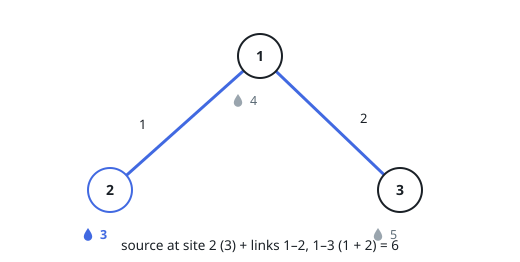

# Least Cost to Supply All Sites

## Description

There are `n` sites, numbered `1` to `n`. Every site must end up supplied,
and there are two ways to supply one:

- build a **source** directly at site `i`, costing `sources[i - 1]`;
- link it to another supplied site — a link between `site1` and `site2`
  costs whatever that link charges.

The array `links` holds the available links, each entry
`[site1, site2, cost]`; links are usable in either direction, and several
links between the same pair of sites may exist at different costs.

Return the least total cost at which every site becomes supplied.

### Example 1

```text
Input: n = 3, sources = [4,3,5], links = [[1,2,1],[1,3,2]]
Output: 6
Explanation: Build one source, at site 2, for 3, then use both links —
site 1 joins site 2 for 1 and site 3 joins site 1 for 2 — so the plan
costs 3 + 1 + 2 = 6.
```



### Example 2

```text
Input: n = 2, sources = [2,2], links = [[1,2,3],[1,2,1]]
Output: 3
Explanation: Two links join the sites, at cost 3 and cost 1; the cheaper
one is used. Building a source at site 1 (2) and linking site 2 (1) costs
3, which beats building sources at both sites (4).
```

### Example 3

```text
Input: n = 4, sources = [6,6,1,6], links = [[1,2,2],[2,3,2],[3,4,2]]
Output: 7
Explanation: Site 3 gets the only source (1); the chain of three links
(2 each) reaches the other sites, for 1 + 6 = 7.
```

### Constraints

- `2 <= n <= 10⁴`
- `sources.length == n`
- `0 <= sources[i] <= 10⁵`
- `1 <= links.length <= 10⁴`
- `links[j].length == 3`
- `1 <= site1_j, site2_j <= n`
- `0 <= cost_j <= 10⁵`
- `site1_j != site2_j`

## Hints

### Hint 1

See the layout as a graph: one node per site, one weighted edge per link.

### Hint 2

Building a source is just another edge — from a new, virtual node to the
site, weighted by that site's source cost.

### Hint 3

With the virtual node added, a plan supplies every site exactly when the
chosen edges connect everything — so the cheapest plan is a minimum
spanning tree on the `n + 1` nodes.

### Hint 4

Kruskal's algorithm with a union-find structure, or Prim's algorithm, both
find that tree efficiently.
