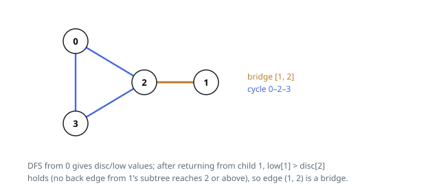

# Solutions — Bridge Edges in a Connected Graph

## Tarjan's bridge finding

A link is a bridge exactly when no detour joins its two endpoints. Run a
depth-first search over the undirected graph and classify every link it
touches: a **tree link**, one the search descends through, or a **back link**,
one to an already-seen node. A back link always closes a cycle, so no back
link is ever a bridge — and a tree link `(u, v)` is one precisely when
nothing inside `v`'s subtree climbs back to `u` or above it.

Two numbers per node carry that test. `disc[u]` is the global counter value
when the search first reaches `u`; `low[u]` is the smallest discovery time
reachable from `u`'s subtree by descending tree links and then taking at most
one back link. When the search returns from a child `v`, the parent folds the
child's reach upward, `low[u] = min(low[u], low[v])`, and checks the bridge
condition `low[v] > disc[u]`: if `v`'s whole subtree cannot see past `u`, the
tree link between them is the only route across, and it is recorded. A back
link to any node other than the parent relaxes `low[u]` with that node's
`disc`; the parent is skipped because the link being skipped is the tree link
itself, not a cycle.

The graph is connected, so a single root (`dfs(0, -1)`) sweeps every node,
and each of the `e` links sits in two adjacency lists and is inspected a
constant number of times — the pass is linear. The collected bridges are
sorted at the end purely to pin the output order, adding the only
logarithmic factor.

On Example 1 the search descends `0 → 2 → 3`, where the back link to `0`
drops `low[3]` to 0 and the tree link `2–3` survives; the leaf `1` returns
`low[1] = disc[1] > disc[2]`, so `1–2` is reported.

**Complexity:** `O(n + e log e)` time, `O(n + e)` space.
