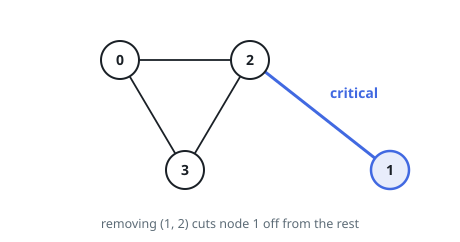

# Bridge Edges in a Connected Graph

## Description

You are given a connected undirected graph on `n` nodes numbered `0` to
`n - 1`. Each entry of `edges` is a pair `[a, b]` naming two nodes joined by a
link, and any node can reach any other along those links.

A link is a **bridge** when cutting it would leave the graph disconnected —
some pair of nodes could no longer reach each other.

Return every bridge as a list `[a, b]`. The order of the pairs, and the order
within each pair, do not matter.

### Example 1

```text
Input: n = 4, edges = [[0,2],[2,3],[3,0],[2,1]]
Output: [[1,2]]
Explanation: Nodes 0, 2 and 3 sit on a cycle, so none of their links is a
bridge. The link to node 1 has no alternative route and is one.
```



### Example 2

```text
Input: n = 5, edges = [[0,1],[1,2],[2,3],[3,4],[4,0],[1,3]]
Output: []
Explanation: The ring alone would make every link safe, and the extra link
from 1 to 3 adds a second route; nothing is a bridge.
```

### Example 3

```text
Input: n = 3, edges = [[2,1],[1,0]]
Output: [[0,1],[1,2]]
Explanation: The graph is a chain, and cutting either link splits it.
```

### Constraints

- `2 <= n <= 10⁵`
- `n - 1 <= edges.length <= 10⁵`
- `0 <= a, b <= n - 1` for every link `[a, b]`
- no link joins a node to itself
- no link appears twice
- the graph is connected

## Hints

### Hint 1

A link with a second route between its endpoints is safe; a link without one
is a bridge. Cycles are exactly where second routes come from.

### Hint 2

Walk the graph depth-first and record, for each node, when it was first seen
— its discovery time.

### Hint 3

Track, per node, the earliest discovery time its subtree can climb back to by
following at most one link that is not the tree link to its parent. A tree
link `(u, v)` is a bridge exactly when `v`'s subtree cannot climb past `u`.
