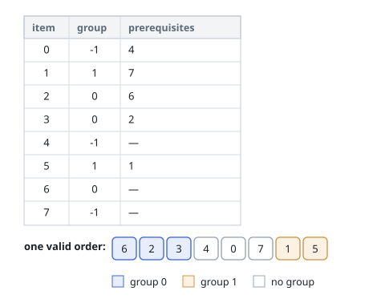

# Grouped Items in Dependency Order

## Description

There are `n` items, numbered `0` to `n - 1`, and `m` groups, numbered `0` to
`m - 1`. Entry `group[i]` names the group item `i` belongs to, or `-1` when it
belongs to none; a group may end up empty.

Some items must precede others: `prerequisites[i]` lists every item that has
to sit to the left of item `i`.

Produce an ordering of all `n` items such that:

- items sharing a group occupy consecutive positions, and
- every listed prerequisite of an item appears somewhere to its left.

Any ordering that meets both rules is acceptable. If none exists, return an
empty list.

### Example 1

```text
Input: n = 8, m = 2, group = [-1,1,0,0,-1,1,0,-1], prerequisites = [[4],[7],[6],[2],[],[1],[],[]]
Output: [6,2,3,4,0,7,1,5]
```



### Example 2

```text
Input: n = 8, m = 2, group = [-1,1,0,0,-1,1,0,-1], prerequisites = [[4],[7],[6],[2],[],[1],[2],[]]
Output: []
Explanation: Identical to example 1 except that 2 must also come before 6.
Inside group 0 the chain now runs 6 → 2 → 6, a circle no ordering satisfies.
```

### Constraints

- `1 <= m <= n <= 3 * 10⁴`
- `group.length == prerequisites.length == n`
- `-1 <= group[i] <= m - 1`
- `0 <= prerequisites[i].length <= n - 1`
- `0 <= prerequisites[i][j] <= n - 1`
- `i != prerequisites[i][j]`
- no duplicates within `prerequisites[i]`

## Hints

### Hint 1

Treat each "must come before" pair as a directed edge and ask what a valid
left-to-right walk of the items looks like.

### Hint 2

Same-group items must sit together, so the output is really a sequence of
whole groups. Which edges decide the order of the groups themselves?

### Hint 3

Two orderings, one nested inside the other: order the groups by the edges
that cross between them, then order each group's items by the edges that stay
within it.

### Hint 4

An item in no group is easiest to handle as a group of its own, so both
orderings can treat every item the same way.
