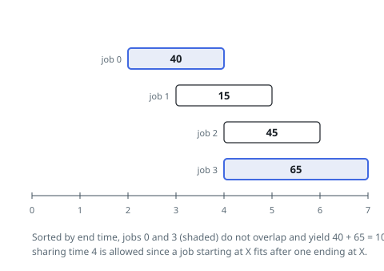

# Solutions — Most Profit From Non-Overlapping Jobs

## Weighted interval scheduling

Each job is a span with a price, and the question is which spans to buy so
that no two collide — the textbook weighted interval scheduling problem.
The decision order that makes it tractable is end time: settle jobs from
earliest deadline to latest, because a job's fate never depends on a later
deadline. `best[i]` then holds the largest payment collectable using only
the first `i` jobs of that order, with `best[0] = 0` anchoring the
induction.

Each step is one binary choice about job `i`. Skipping keeps `best[i - 1]`.
Taking it pays `profit[i]` on top of the best schedule that had already
finished when job `i` begins — and finding that schedule is where the
ordering pays off: with the jobs sorted by end time, their end times form a
sorted array, and the number of them at or before job `i`'s start comes
from a binary search. Searching *at or before* rather than strictly before
encodes the touching rule from the statement — a span ending at `X` and one
starting at `X` do not collide, as Example 1's [2,4) and [4,7) show.

Restricting the search to the first `i - 1` entries keeps predecessors
inside the already-processed prefix, and reading `best[j]` there is safe
because end-time order finalizes it early. Packing tuples as
`(end, start, profit)` makes the sort produce both the processing order and
the searchable end-time array at once; the recurrence
`best[i] = max(best[i - 1], best[j] + profit[i])` then runs straight down
the array, and `best[n]` weighs every job. Example 2's [5,8) and [8,10)
chain the same way, and Example 3's three mutually conflicting jobs
degenerate to the largest single profit.

**Complexity:** `O(n log n)` time, `O(n)` space.
