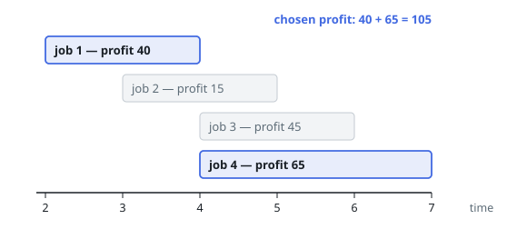
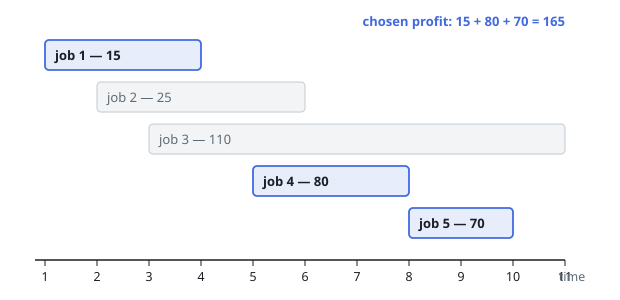
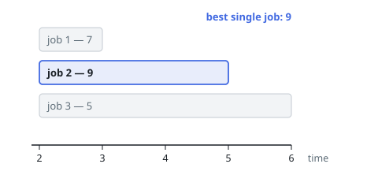

# Most Profit From Non-Overlapping Jobs

## Description

Each of `n` jobs occupies a half-open time span: job `i` runs from
`startTime[i]` up to `endTime[i]` and pays `profit[i]` if completed.

Choose a set of jobs to run so that no two chosen spans share a moment of
time, and return the largest total payment such a set can earn. A job that
ends at time `X` leaves the instant `X` free, so another job may start
exactly at `X`.

### Example 1

```text
Input: startTime = [2,3,4,4], endTime = [4,5,6,7], profit = [40,15,45,65]
Output: 105
Explanation: Running job 1 and job 4 covers [2,4) and [4,7) — the spans
touch at 4 without overlapping — for 40 + 65 = 105. Adding job 3 in place of
job 4 pays less (40 + 45), and job 2 conflicts with job 1.
```



### Example 2

```text
Input: startTime = [1,2,3,5,8], endTime = [4,6,11,8,10], profit = [15,25,110,80,70]
Output: 165
Explanation: Jobs 1, 4, and 5 chain [1,4), [5,8), [8,10) for
15 + 80 + 70 = 165. The tempting job 3 pays 110 on its own but blocks the
whole middle of the day, and no combination containing it reaches 165.
```



### Example 3

```text
Input: startTime = [2,2,2], endTime = [3,5,6], profit = [7,9,5]
Output: 9
Explanation: All three jobs are live at time 2, so at most one can run;
the best of them pays 9.
```



### Constraints

- `1 <= startTime.length == endTime.length == profit.length <= 5 * 10^4`
- `1 <= startTime[i] < endTime[i] <= 10^9`
- `1 <= profit[i] <= 10^4`

## Hints

### Hint 1

Decide each job's fate in a fixed order. End time is the order that works:
once a job is settled, no later decision can move an earlier deadline.

### Hint 2

Let `best[i]` be the largest payment collectable from the first `i` jobs in
end-time order. Job `i` is either skipped — `best[i-1]` stands — or taken,
adding its profit to the best schedule that already ended when it starts.

### Hint 3

Finding that schedule is a binary search: among the sorted end times, count
the jobs that ended at or before this job's start time.

### Hint 4

Counting end times at or before — not strictly before — the start is what
lets one job begin at the exact moment another ends.
