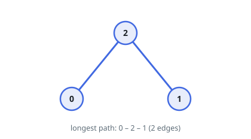
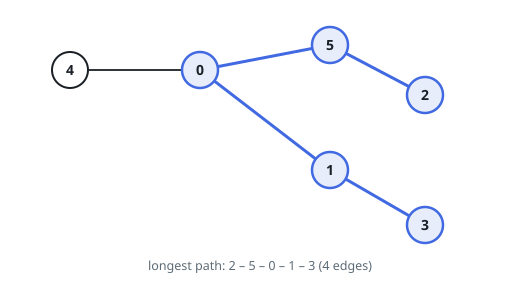

# Widest Tree Path From an Edge List

## Description

A tree with `n` nodes labeled `0` to `n - 1` is handed to you as its edge
list: `edges[i] = [a, b]` joins nodes `a` and `b`, and the list has exactly
`n - 1` entries.

Between any two nodes of a tree runs exactly one path. Return the number of
edges on the longest such path.

### Example 1

```text
Input: edges = [[0,2],[1,2]]
Output: 2
Explanation: Node 2 sits in the middle, so the trip from 0 through 2 to 1
uses both edges.
```



### Example 2

```text
Input: edges = [[4,0],[0,5],[5,2],[0,1],[1,3]]
Output: 4
Explanation: The longest route runs 2 - 5 - 0 - 1 - 3. Hanging node 4 off
node 0 adds only a side branch: reaching it never pays more than staying on
the 2-to-3 corridor.
```



### Example 3

```text
Input: edges = [[3,0],[0,2],[2,1]]
Output: 3
Explanation: The tree is a bare chain, so the longest route is the whole
chain, from 3 to 1.
```

### Constraints

- `n == edges.length + 1`
- `1 <= n <= 10^4`
- `0 <= a, b < n`
- `a != b`

## Hints

### Hint 1

Pick any node `A` and find the node `B` farthest from it. A classic tree
fact says `B` is an endpoint of a longest path — the trip from `A` must
reach at least that far no matter where the true endpoints sit.

### Hint 2

With `B` in hand, find the node `C` farthest from `B`. The distance between
`B` and `C` is the answer.

### Hint 3

Each "farthest node" query is a breadth-first search: a tree offers exactly
one route between two nodes, so BFS layer counts are true distances.
